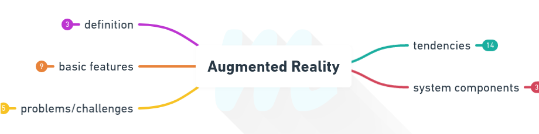
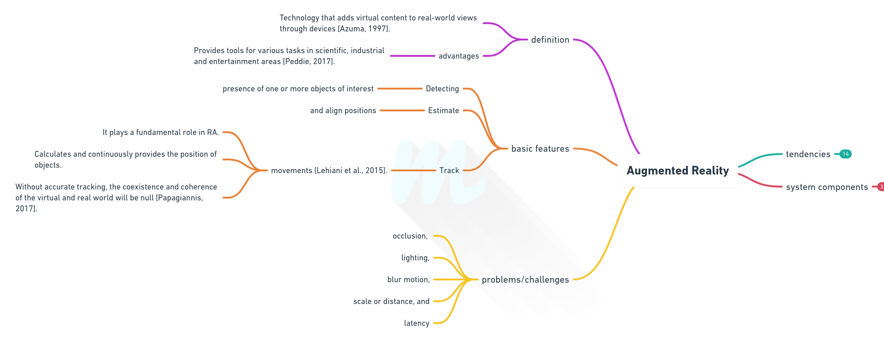
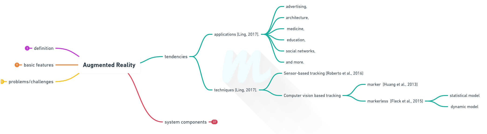
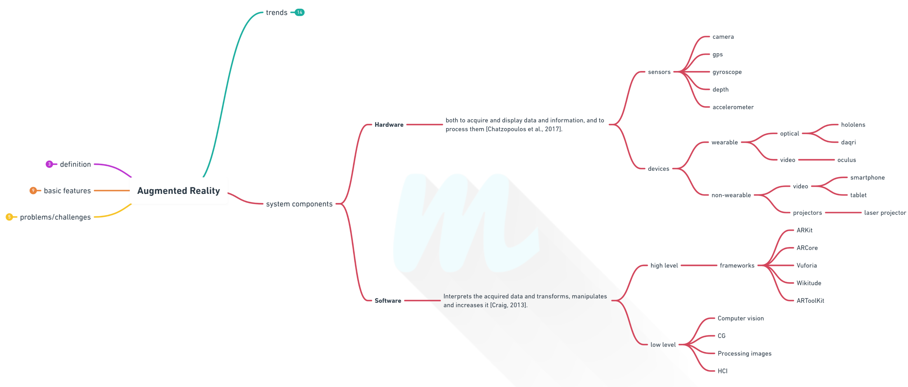
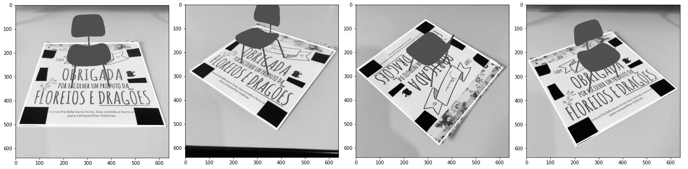

# Augmented Reality 101

The development of areas such as computer vision, image processing, and computer graphics, allow the introduction of technologies such as **Augmented Reality**.

[Azuma](https://www.cs.unc.edu/~azuma/ARpresence.pdf) defines **Augmented Reality** as *"a technology that adds computer-generated virtual content to real-world views through devices"*.

## Introduction

The purpose of these map is to give you an idea about **Augmented Reality** and to guide you through the main features that surround this technology.



> Read complete post in [AR 101 — Augmented Reality](https://medium.com/@mafda_/ar-101-augmented-reality-6bc92a863b2e).

### Definition and basic features



> Read complete post in [AR 101 — A brief summary (Part 1)](https://medium.com/@mafda_/ar-101-a-brief-summary-part-1-a5b43fad8e4).

### Horizontal and vertical trends



> Read complete post in [AR 101 — Augmented Reality Trends (Part 2)](https://medium.com/@mafda_/ar-101-augmented-reality-trends-part-2-9c5f86ca0de1).

### Basic process and main components



> Read complete post in [AR 101 — Components of the Augmented Reality System (Part 3)](https://medium.com/@mafda_/ar-101-components-of-the-augmented-reality-system-part-3-878c71e68069).

## Augmented Reality Application

 In this repository, I want to present a **basic implementation** that projects on the screen a 3D model aligned (orientation and translation) to a predefined flat surface.

However, currently the industry is investing in different frameworks as [ARCore](https://developers.google.com/ar/discover), [ARKit](https://developer.apple.com/augmented-reality/), and [Vuforia](https://developer.vuforia.com/), among others, which provide the community more accessible technologies with more realistic results and experiences.

The repository has two parts:

1. [Image](src/ar_python3_opencv4.ipynb) is the implementation, step by step, with some basic definitions, to add a 3D model to a flat image.
2. [Video](src/ar_python3_opencv4.py)  is the implementation to have the experience in real-time through a camera.

### Instalation

```
git clone git@github.com:mafda/augmented_reality_101.git
```


### Environment

The tools we will use are Python 3 and OpenCV 4.2.

1. Create virtual environment:

```
python -m venv /path/to/new/virtual/environment
```

2. Activate environment:

```
source /path/to/new/virtual/environment/bin/activate
```

3. Install requirements.txt file:

```
pip install -r requirements.txt
```

4. For [Image](src/ar_python3_opencv4.ipynb)

```
python -m jupyter notebook
```

5. For [Video](src/ar_python3_opencv4.py)

```
python ar_python3_opencv4.py
```

### Model 3D

* [Chair](https://clara.io/view/67bc637b-c528-44a0-bfbc-84335d12bcfa) from [Clara.io](https://clara.io/scenes)

### Results


 

## Repository References

* JE Solem, *Programming Computer Vision with Python: Tools and algorithms for analyzing images*. O'Reilly Media, Inc.
* [Programming Computer Vision with Python](http://programmingcomputervision.com/)
* [Open source Python module for computer vision ](https://github.com/jesolem/PCV)
* [Augmented reality with Python and OpenCV](https://bitesofcode.wordpress.com/2017/09/12/augmented-reality-with-python-and-opencv-part-1/)
* [augmented-reality](https://github.com/juangallostra/augmented-reality)
* [OBJFileLoader](https://github.com/yarolig/OBJFileLoader)

## Map References

* Azuma, R. T. (1997). *A survey of augmented reality*. Presence: Teleoper. Virtual Environ., 6(4):355–385. [Paper](https://www.cs.unc.edu/~azuma/ARpresence.pdf) 

* Chatzopoulos, D., Bermejo, C., Huang, Z., and Hui, P. (2017). *Mobile augmented reality survey: From where we are to where
we go.* IEEE Access, 5:6917–6950. [Paper](https://ieeexplore.ieee.org/document/7912316)

* Craig, A. (2013). *Understanding Augmented Reality: Concepts and Applications.* Elsevier Science, 1 edition. [Book](https://www.sciencedirect.com/book/9780240824086/understanding-augmented-reality)

* Fleck, P., Arth, C., Pirchheim, C., and Schmalstieg, D. (2015).   *Tracking and mapping with a swarm of heterogeneous clients*. In 2015 IEEE International Symposium on Mixed and Augmented Reality, pages 136–139. [Paper](https://ieeexplore.ieee.org/document/7328080)

* Huang, Z., Hui, P., Peylo, C., and Chatzopoulos, D. (2013). *Mobile augmented reality survey: a bottom-up approach.* CoRR. [Paper](https://arxiv.org/pdf/1309.4413.pdf)

* Lehiani, Y., Maidi, M., Preda, M., and Ghorbel, F. (2015). *Object identification and tracking for steady registration in mobile augmented reality*. In 2015 IEEE International Conference on Signal and Image Processing Applications (ICSIPA), pages 54–59. [Paper](https://ieeexplore.ieee.org/document/7412163)

* Ling, H. (2017). *Augmented reality in reality*. IEEE MultiMedia, 24(3):10–15. [Paper](https://ieeexplore.ieee.org/document/7999155)

* Papagiannis, H. (2017). *Augmented Human: How Technology Is Shaping the New Reality.* O’Reilly Media. [Book](https://www.augmentedhuman.co/)

* Peddie, J. (2017). *Augmented Reality: Where We Will All Live.* Springer International Publishing. [Book](https://www.springer.com/gp/book/9783319545011)

* Roberto, R., Lima, J. P., and Teichrieb, V. (2016). *Tracking for mobile devices: A systematic mapping study.* Computers & Graphics, 56:20 – 30. [Paper](https://www.cin.ufpe.br/~in1123/2017-1/leitura/roberto.pdf)

---

made with 💙 by [mafda](https://mafda.github.io/)